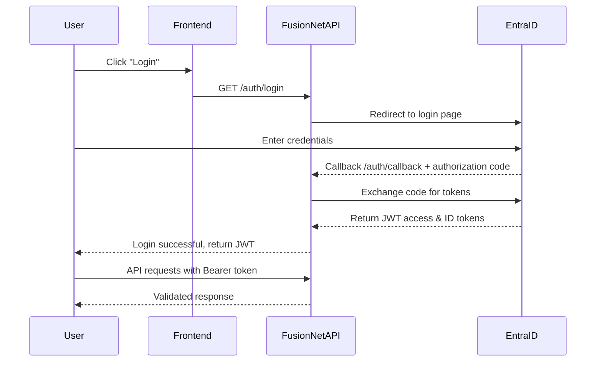
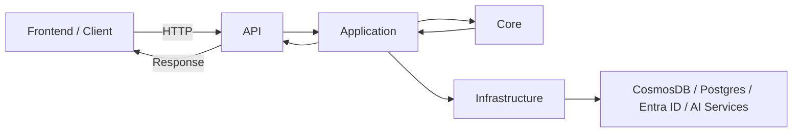

# FusionNet Authentication API (Microsoft Entra ID)

Welcome! This document explains FusionNet's authentication system using **Microsoft Entra ID** (Azure AD).  
It’s designed for **new developers** to understand, implement, and test authentication flows quickly.

---

## 1. Overview

FusionNet uses **Microsoft Entra ID** for:

- **Authentication** – verifying user identity.
- **Authorization** – granting access to resources based on roles (Admin, Reviewer, User).

All API requests require a **valid JWT access token** issued by Entra ID.

> FusionNet uses **server-side OAuth2 authorization code flow**: the backend handles token exchange and storage, not the frontend.

---

## 2. Authentication Flow

### Flow Diagram

