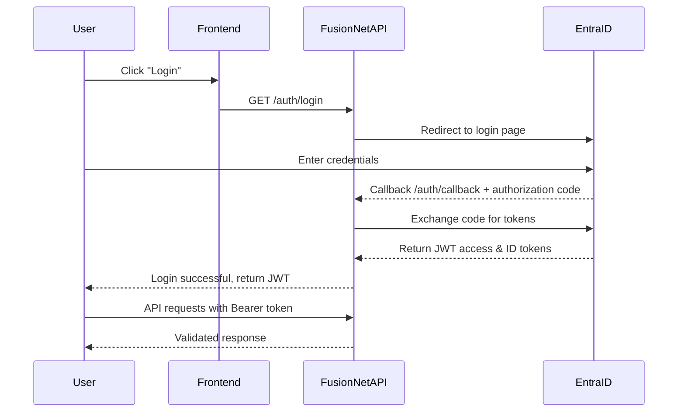
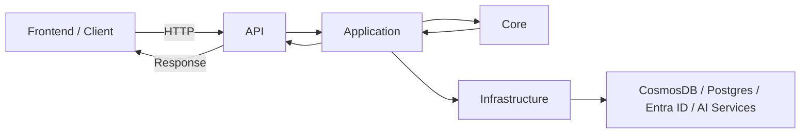
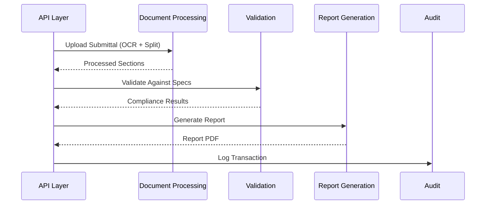
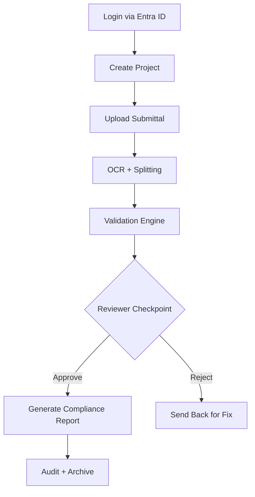

# FusionNet Authentication API (Microsoft Entra ID)

Welcome! This document explains FusionNet's authentication system using **Microsoft Entra ID** (Azure AD).  
It’s designed for **new developers** to understand, implement, and test authentication flows quickly.

---

## 1. Overview

FusionNet uses **Microsoft Entra ID** for:

- **Authentication** – verifying user identity.
- **Authorization** – granting access to resources based on roles (Admin, Reviewer, User).

All API requests require a **valid JWT access token** issued by Entra ID.

> FusionNet uses **server-side OAuth2 authorization code flow**: the backend handles token exchange and storage, not the frontend.

---

## 2. Authentication Flow

### Flow Diagram

| Label                    | Purpose |
|---------------------------|---------|
| `module:review-orchestration` | Tracks orchestration module |
| `module:document-processing`  | Tracks OCR/splitting |
| `module:validation`           | Tracks spec matching & compliance |
| `module:report-generation`    | Tracks reporting |
| `module:audit`                | Tracks auditing |
| `extraction-ready`            | Module is microservice-ready |
| `needs-refactor`              | Cleanup required before extraction |
| `has-shared-db`               | DB schema shared (technical debt) |
| `performance-impact`          | SLA/performance risk |
| `idempotency-required`        | Must guarantee deterministic outputs |
| `hitl-checkpoint`             | Human review point required |

### Code Preparation
- [ ] No direct cross-module references.  
- [ ] Interfaces/contracts live in `Contracts/`.  
- [ ] Test coverage > 80%.  
- [ ] Module-specific exceptions exist.  
- [ ] Logging categories are module-specific.

