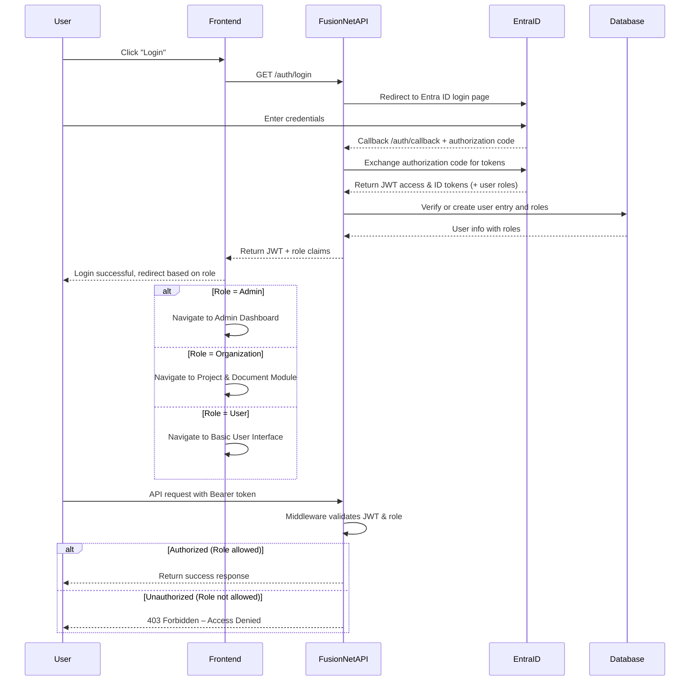
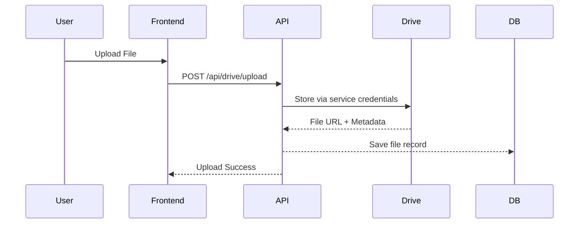

# Authentication API (Microsoft Entra ID)

FusionNet leverages Microsoft Entra ID to handle authentication and role-based authorization. All API requests must include a valid JWT access token obtained via the Entra ID OAuth2/OpenID Connect flow.  
This ensures secure access to backend endpoints while centralizing authentication logic.

---

## Authentication Flow

FusionNet uses a **server-side OAuth2 authorization code flow**:

1. **Login Redirect**  
   - User initiates login by calling `/api/auth/login`.  
   - Backend redirects the user to the Microsoft Entra ID login page.  
   - User authenticates with organizational credentials.  
   - Entra ID returns an **authorization code** to the configured redirect URI.

2. **Token Exchange**  
   - Backend exchanges the authorization code for:  
     - **JWT access token** – authenticates API requests.  
     - **ID token** – contains user profile info.  
     - **Refresh token** (optional) – obtain new access tokens without logging in again.  
   - Tokens are signed and validated using Microsoft’s public keys.

3. **API Access**  
   - All secured API requests must include header:  
     ```
     Authorization: Bearer <jwt-access-token>
     ```
   - Backend middleware validates the JWT:  
     - Signature verification  
     - Expiration check  
     - Role-based access control  

   **Example middleware usage in FusionNet:**  
   ```csharp
   app.UseAuthentication();
   app.UseAuthorization();
   ```
4. **Logout**
- Invalidate local session and redirect to Entra ID logout endpoint.
- Ensures the user session is fully terminated.

## Endpoints
1. **Login**

GET /api/auth/login
- Initiates login process.
- Redirects user to Microsoft Entra ID login page.
- Example redirect:
```
https://login.microsoftonline.com/<TENANT_ID>/oauth2/v2.0/authorize?client_id=<CLIENT_ID>&response_type=code&redirect_uri=<REDIRECT_URI>&scope=openid profile email
```

2. **Callback**
GET /api/auth/callback
- Entra ID redirects here after successful login.
- Backend exchanges authorization code for tokens.
- Retrieves user info and assigns roles.

Response Example:
```
{
  "userId": "f12345",
  "email": "jdoe@company.com",
  "roles": ["Reviewer", "Admin"],
  "token": "<jwt-access-token>"
}
```

Notes:
- Roles enforce module-specific access.
- Tokens should be stored securely (HTTP-only cookies or secure local storage).

3. **Logout**
POST /api/auth/logout
- Validates user session in FusionNet backend.
- Redirects to Entra ID logout URL.
- Clears local session cookies.

Response Example:
```
{
  "status": "logged-out"
}
```


## 3. Configuration

FusionNet uses the following environment variables (stored in GitHub secrets for CI/CD):

| Variable | Description |
|----------|-------------|
| `ENTRA_TENANT_ID` | Your Microsoft Entra tenant ID |
| `ENTRA_CLIENT_ID` | Client ID of the registered FusionNet app |
| `ENTRA_CLIENT_SECRET` | Client secret for the app registration |
| `ENTRA_REDIRECT_URI` | Redirect URI after login (callback endpoint) |
| `ENTRA_AUTHORITY` | Usually `https://login.microsoftonline.com/<TENANT_ID>` |

**Example .env file:**
```
ENTRA_TENANT_ID=xxxx-xxxx-xxxx
ENTRA_CLIENT_ID=xxxx-xxxx-xxxx
ENTRA_CLIENT_SECRET=xxxxxxxx
ENTRA_REDIRECT_URI=https://fusionnet.example.com/auth/callback
ENTRA_AUTHORITY=https://login.microsoftonline.com/xxxx-xxxx-xxxx
```


## 4. Role-Based Access Control (RBAC)
**Common roles:**

- **Admin** – full access to all modules.
- **Organization** – can Create project and Upload documents.
- **User** – basic access.

Middleware checks user roles before processing requests:
```
[Authorize(Roles = "Admin,Reviewer")]
public IActionResult GetDocuments() { ... }
```

FusionNet uses Microsoft Entra ID as the single source for both authentication and authorization roles. After the user authenticates via OAuth2, FusionNet's backend retrieves the user's role claims and group memberships through the Microsoft Graph API.

### 4.1 Role Overview

Roles are defined and managed within Microsoft Entra ID. FusionNet does not assign roles manually; instead, it reads them dynamically from Entra ID using the Graph API during login or token validation.

| Role | Description | Access Level |
|------|-------------|--------------|
| Admin (GCS) | Full system control. Manages organizations, users, and configurations. | Full access |
| Organization | Represents a client organization responsible for creating projects and uploading submittals. | Create/manage projects, upload documents, view reports |
| Reviewer (User) | Reviews and approves project submittals. | Approve/reject documents, provide feedback |


### 4.2 Role Retrieval Process

1. **User Authenticates via Entra ID:**
   - The user logs in through the `/api/auth/login` endpoint and authenticates on the Entra ID login page.

2. **Callback and Token Exchange:**
   - Entra ID returns an authorization code to `/api/auth/callback`.
   - Backend exchanges the code for access and ID tokens.

3. **Fetch User Roles from Microsoft Graph API:**
   - Using the obtained access token, FusionNet calls:
     ```
     GET https://graph.microsoft.com/v1.0/me/memberOf
     ```
   - The response includes the user's groups or app roles assigned in Entra ID.

4. **Role Mapping (Optional):**
   - FusionNet maps Entra ID roles or group names to application-level roles (e.g., "FusionNet_Admin", "FusionNet_Reviewer").
   - This allows flexibility if Entra ID groups have enterprise-specific names.

5. **Embed Roles in JWT Claims:**
   - The backend includes resolved roles inside the FusionNet JWT token so that subsequent API calls can enforce role-based access efficiently.

### 4.3 Security Enforcement

- All role information comes directly from Entra ID / Microsoft Graph — reducing local security risks.
- Tokens are short-lived and validated on every request.
- Access control relies solely on verified JWT role claims.
- Logging and monitoring capture login, logout, and authorization events for auditing.

## 5. Security Best Practices

- Always use HTTPS for login and API endpoints.
- Validate JWT tokens server-side.
- Use short-lived access tokens and refresh tokens if needed.
- Do not store tokens in local storage on frontend (XSS risk).
- Log authentication events for auditing.

### Security Notes

- All tokens must be validated server-side before granting access.
- Avoid storing access tokens in local storage for frontend apps to reduce XSS risk.
- Use HTTPS for all authentication and token exchange endpoints.
- Implement role-based access control on every API endpoint to ensure only authorized users can perform sensitive actions.

## 6. Flow Diagram



---

# Service Integration (Drives)

## 1. Overview

The Drive module handles:

- Uploading, listing, downloading, and deleting project documents
- Mapping uploaded files to project metadata in FusionNet DB
- Unified interface across all storage providers

**Default Providers:**

- **SharePoint / OneDrive** → Main document repository (via Graph API)
- **Azure Blob** → Stores split, processed, and AI-generated files
- **Google Drive** → Optional for GSuite clients

## 2. Endpoints

### 2.1 Connect to Drive

**POST** `/api/drive/connect`

- Establishes or refreshes a service-level connection to the configured drive provider (SharePoint, Azure Blob, or Google Drive).
- Used internally by the backend to fetch access tokens or validate credentials.

**Request Example:**
```
{
"provider": "sharepoint"
}
```

**Response Example:**
```
{
"status": "connected",
"provider": "sharepoint",
"tokenExpiry": "2025-10-16T12:45:00Z"
}
```


**Notes:**

- Uses stored credentials from Azure Key Vault / GitHub Secrets.
- No user credentials required.
- Response confirms valid backend connectivity with the drive.

### 2.2 Upload

**POST** `/api/drive/upload`

Uploads a document to the configured provider.

**Response:**
```
{
"status": "success",
"provider": "sharepoint",
"fileUrl": "https://sharepoint.com/.../HVAC_Submittal.pdf"
}
```


### 2.3 List Files

**GET** `/api/drive/list?projectId=<id>`

Lists all files linked to a project.

### 2.4 Download

**GET** `/api/drive/download?fileId=<id>`

Streams file from storage using a secure (temporary) URL.

### 2.5 Delete

**DELETE** `/api/drive/delete`

Deletes file from both storage and FusionNet DB.

## 3. Configuration

| Variable | Description |
|----------|-------------|
| `SHAREPOINT_CLIENT_ID` / `CLIENT_SECRET` | Azure AD app credentials |
| `SHAREPOINT_TENANT_ID` / `SITE_ID` / `DRIVE_ID` | Identifiers for SharePoint site and drive |
| `AZURE_BLOB_CONNECTION_STRING` | Connection string or AAD token |
| `AZURE_BLOB_CONTAINER` | Target blob container |
| `GOOGLE_SERVICE_ACCOUNT_JSON` | Base64-encoded GCP service account JSON |

## 4. Authentication

| Provider | Auth Type | Usage |
|----------|-----------|-------|
| SharePoint | OAuth2 Client Credentials | Upload & list via Microsoft Graph API |
| Azure Blob | AAD Service Principal / SAS | AI outputs & split PDFs |
| Google Drive | OAuth2 Service Account | Optional ingestion |

All credentials are securely stored in Azure Key Vault and GitHub Secrets.

## 5. Role-Based Access

| Role | Permissions |
|------|-------------|
| Admin | Full CRUD on all files |
| Organization | Upload, list, delete project files |
| Reviewer | Read-only access |

**Example:**
```
[Authorize(Roles = "Admin,Organization")]
[HttpPost("upload")]
```


## 6. Security Practices

- HTTPS enforced for all operations
- MIME type and file size validation
- Temporary SAS / pre-signed URLs for downloads
- All file events logged for auditing
- Tokens and keys rotated regularly

## 7. File Flow Diagram



## 8. Security Controls

- All service credentials are stored in Azure Key Vault and GitHub Secrets.
- No user-based authentication for SharePoint or Google Drive integrations.
- Backend services perform access using scoped service accounts only.
- Access tokens and API keys never exposed to frontend clients.
- Least-privilege principle applied to all service permissions.
