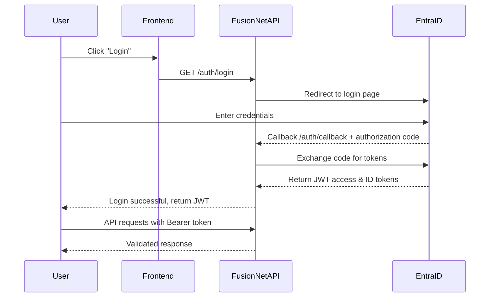

# Authentication API (Microsoft Entra ID)

FusionNet leverages **Microsoft Entra ID**  to handle authentication and role-based authorization. All API requests **must include a valid JWT access token** obtained via the Entra ID OAuth2/OpenID Connect flow.

This ensures secure access to backend endpoints while centralizing authentication logic.

---

## Authentication Flow

FusionNet uses a **server-side OAuth2 authorization code flow**:

1. **Login Redirect**
   - User initiates login by calling the backend `/api/auth/login` endpoint.
   - Backend redirects the user to the **Microsoft Entra ID login page**.
   - User authenticates with their organizational credentials.
   - Entra ID returns an **authorization code** to the configured redirect URI.

2. **Token Exchange**
   - Backend exchanges the authorization code for:
     - **JWT access token** – used to authenticate API requests.
     - **ID token** – contains user profile information.
     - **Refresh token** – optional, used to obtain new access tokens without logging in again.
   - Tokens are signed and validated using Microsoft’s public keys.

3. **API Access**
   - All secured API requests must include the header:  
     ```
     Authorization: Bearer <jwt-access-token>
     ```
   - Backend middleware validates the JWT:
     - Signature verification.
     - Expiration check.
     - Role-based access control.
   - Example middleware usage in FusionNet:
     ```csharp
     app.UseAuthentication();
     app.UseAuthorization();
     ```

4. **Logout**
   - Invalidate the local session and redirect to Entra ID logout endpoint.
   - Ensures the user session is fully terminated.

---

## 📥 Endpoints

### 1. Login
**GET** `/api/auth/login`

- Initiates the login process.
- Redirects the user to **Microsoft Entra ID login page**.
- Example:
**GET /auth/login**
**Redirect ->** https://login.microsoftonline.com/<TENANT_ID>/oauth2/v2.0/authorize?client_id=<CLIENT_ID>&response_type=code&redirect_uri=<REDIRECT_URI>&scope=openid profile email


---

### 2. Callback
**GET** `/api/auth/callback`

- Entra ID redirects here after successful login.
- Backend exchanges **authorization code** for tokens.
- Retrieves user info and assigns roles.

**Response Example:**
```json
{
"userId": "f12345",
"email": "jdoe@company.com",
"roles": ["Reviewer", "Admin"],
"token": "<jwt-access-token>"
}
``` 
**Notes:**
- Roles are used by FusionNet backend to enforce module-specific access.
- Tokens should be stored securely (e.g., HTTP-only cookies or secure local storage for frontend apps).

---

### 3. Logout

**POST** `/api/auth/logout`

- validates user session in FusionNet backend.
- Redirects to Entra ID logout URL to end the Microsoft session.
- Clear the Cookie session also

Response Example:
```json
{
  "status": "logged-out"
}
```

---

### Configuration

FusionNet uses the following environment variables (stored in GitHub secrets for CI/CD):

**Variable	Description**
ENTRA_TENANT_ID - 	Your Microsoft Entra tenant ID
ENTRA_CLIENT_ID - 	Client ID of the registered FusionNet app
ENTRA_CLIENT_SECRET - 	Client secret for the app registration
ENTRA_REDIRECT_URI- 	Redirect URI after login (callback endpoint)
ENTRA_AUTHORITY	- Usually https://login.microsoftonline.com/<TENANT_ID>

**Example .env file:**

ENTRA_TENANT_ID=xxxx-xxxx-xxxx
ENTRA_CLIENT_ID=xxxx-xxxx-xxxx
ENTRA_CLIENT_SECRET=xxxxxxxx
ENTRA_REDIRECT_URI = https://fusionnet.example.com/auth/callback
ENTRA_AUTHORITY = https://login.microsoftonline.com/xxxx-xxxx-xxxx

---

### Role-Based Access Control (RBAC)

FusionNet enforces roles at the backend:

- Roles are returned by /auth/callback.
**- Common roles:**
  - **Admin** – full access to all modules.
  - **Organization** – can Create project and Upload documents.
  - **User** – basic access.

- Middleware checks user roles before processing requests:
    [Authorize(Roles = "Admin,Reviewer")]
    public IActionResult GetDocuments() { ... }

---

### Security Best Practices

  - Always use HTTPS for login and API endpoints.
  - Validate JWT tokens server-side.
  - Use short-lived access tokens and refresh tokens if needed.
  - Do not store tokens in local storage on frontend (XSS risk).
  - Log authentication events for auditing.

**Security Notes**

  - All tokens must be validated server-side before granting access.
  - Avoid storing access tokens in local storage for frontend apps to reduce XSS risk.
  - Use HTTPS for all authentication and token exchange endpoints.
  - Implement role-based access control on every API endpoint to ensure only authorized users can perform sensitive actions.

---

### 7. Flow Diagram (Text-Based)


---

### Summary

- FusionNet uses server-side OAuth2 authorization code flow.
- Tokens are required for all API requests.
- Backend enforces role-based access control.
- Developers should configure environment variables and test login/logout flows before building new features.
