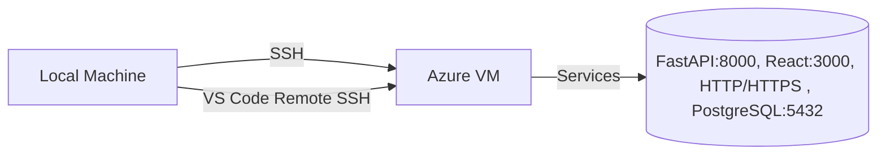

# Azure VM Connection Guide - PowerShell & VS Code

This guide shows how to connect to Azure VMs using PowerShell and configure VS Code for remote development.

---

## 1. Architectural Overview

The following diagram illustrates the VM configuration and the connection flow between your local machine and the Azure VM.

### Azure VM Configuration
- **OS**: Ubuntu 24.04 LTS (Linux)  
- **CPU**: 4 vCPUs  
- **RAM**: 16 GB  
- **Storage**: 128 GB SSD  
- **Public IP**: `xx.xx.xx.xx`  
- **Inbound Rules**:  
  - SSH (22)  
  - HTTP (80)  
  - HTTPS (443)  
  - FastAPI (8000)  
  - React (3000)
  - PostgreSQL (5432)  

### Connection Flow
Your local machine can connect to the VM via **SSH** from a command-line interface (PowerShell) or through **VS Code’s Remote Development extensions**. Both methods use the same SSH protocol to establish a secure connection.


---

## 2. Initial Local Setup: Tools and Extensions

Before you begin, ensure your local machine has the necessary tools installed.

**Step 1: Install Azure CLI**

Open PowerShell as an Administrator and run:
``` $ProgressPreference = 'SilentlyContinue'; Invoke-WebRequest -Uri https://aka.ms/installazurecliwindowsx64 -OutFile .\AzureCLI.msi; Start-Process msiexec.exe -Wait -ArgumentList '/I AzureCLI.msi /quiet'; Remove-Item .\AzureCLI.msi ```

**Verify installation:**
`az --version`

---

**Step 2: Login to Azure**
`az login`

- A browser window will open for authentication.
- Select Grey Consulting Services LLC tenant and the appropriate subscription.

**Verify login:**
`az account show`

---

**Step 3: List Available VMs**
`az vm list -o table`

---

**Step 4: Install the SSH Extension for Azure CLI**
`az extension add --name ssh --upgrade`

---

## 3. SSH Configuration
**Step 5: Create SSH Configuration File**
Create the .ssh directory if it doesn’t exist:
`mkdir $env:USERPROFILE\.ssh -Force`

Generate certificates and keys for your VM:
`az ssh config -g fusnet-eus-dev-rg -n fusnet-eus-dev-app01-vm --file "$env:USERPROFILE\.ssh\config"`

This command creates an SSH configuration file at ~/.ssh/config along with required certificates and keys.

---

**Step 6: Add VM to SSH Config**

Open the newly created SSH configuration file and add the following block (replace placeholders):
```
# Azure VM Configuration
Host fusnet-mustafa
    HostName your_host_name
    User "your_email_id"
    CertificateFile "C:\Users\<windows-user>\.ssh\az_ssh_config\fusnet-eus-dev-rg-fusnet-eus-dev-app01-vm\id_rsa.pub-aadcert.pub"
    IdentityFile "C:\Users\<windows-user>\.ssh\az_ssh_config\fusnet-eus-dev-rg-fusnet-eus-dev-app01-vm\id_rsa"
    IdentitiesOnly yes 
```
---

**Step 7: Test the VM Connection**

From PowerShell, run:
`az ssh vm -g fusnet-eus-dev-rg -n fusnet-eus-dev-app01-vm -- -l email_id`

Expected output:
```Welcome to Ubuntu 20.04.6 LTS (GNU/Linux 5.15.0-1044-azure x86_64)
User@fusnet-eus-dev-app01-vm:~$ 
```
---

## 4. VS Code Remote Development
Install Required Extensions
- Open VS Code → Extensions view (Ctrl+Shift+X)
- Install:
    - Remote – SSH
    - (Optional) Remote – SSH: Editing Configuration Files

**Setup VS Code Connection**
- Open VS Code and press Ctrl+Shift+P
- Run: Remote-SSH: Connect to Host
- Select Configure SSH Hosts...
- Choose: C:/Users/<username>/.ssh/config

**Connect After Setup**
- Press Ctrl+Shift+P
- Run: Remote-SSH: Connect to Host
- Select your configured host (e.g., fusnet-mustafa)
> The first connection may take 30–60 seconds.

---

## 5. Post-Connection VM Configuration

After connecting to the VM with VS Code, install Miniconda:
```cd ~
wget -q https://repo.anaconda.com/miniconda/Miniconda3-latest-Linux-x86_64.sh
bash Miniconda3-latest-Linux-x86_64.sh -b -p $HOME/miniconda3
echo 'export PATH="$HOME/miniconda3/bin:$PATH"' >> ~/.bashrc
source ~/.bashrc
```

---

## 6. Important Note: SSH Key Renewal

> SSH keys expire every ~1 hour.
To generate a new key, run on your local machine in PowerShell:
`az ssh config -g fusnet-eus-dev-rg -n fusnet-eus-dev-app01-vm --file "$env:USERPROFILE\.ssh\config1"`
