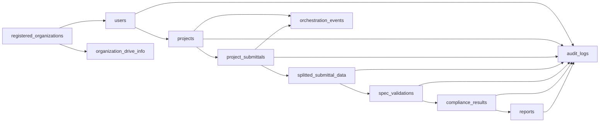

```mermaid
flowchart LR
    RO[registered_organizations] --> U[users]
    U --> P[projects]
    P --> PS[project_submittals]
    PS --> SSD[splitted_submittal_data]
    
    SSD --> SV[spec_validations]
    SV --> CR[compliance_results]
    CR --> R[reports]
    
    RO --> ODI[organization_drive_info]
    
    U --> AL[audit_logs]
    P --> AL
    PS --> AL
    SSD --> AL
    SV --> AL
    CR --> AL
    R --> AL
    
    P --> OE[orchestration_events]
    PS --> OE
```
