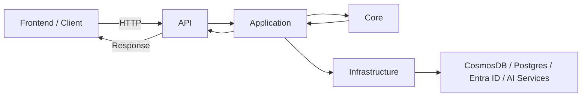

# Clean Architecture in FusionNet MVP

## 1. Why Clean Architecture?

FusionNet is an **AI-driven submittal review platform** for construction and engineering projects.  
The MVP automates the workflow of **submittal ingestion → document splitting → validation → compliance checks → report generation**.

We adopt **Clean (Onion) Architecture** because it ensures the system remains **stable, testable, and future-ready** even as we add new modules or swap technologies.

### Benefits for FusionNet MVP
- **Business rules are protected**  
  Core rules (e.g., *a Submittal must link to a Project and Spec*) remain valid regardless of the database (Postgres, CosmosDB) or AI service used.  

- **Flexibility in evolution**  
  MVP is implemented as a **modular monolith**, but each module (Validation, Document Processing, Reporting) is structured for easy extraction into independent microservices when scaling.  

- **Testability at every layer**  
  - Core and Application → unit tests with no DBs or APIs.  
  - Infrastructure → integration tests with real DB/AI services.  
  - API → end-to-end tests simulating client calls.  

- **Future readiness**  
  The architecture supports scaling to **RFIs, analytics, BIM integrations, and AI-driven design checks** without refactoring the core.  

**In short:** Clean Architecture gives FusionNet a **stable foundation** where business rules stay intact, integrations can change freely, and the MVP can scale into a full platform without a rewrite.

---

## 2. Core Principles

FusionNet’s architecture is based on **Clean (Onion) Architecture principles**.  
These rules define how different layers interact and ensure that the **business domain stays protected from technology churn**.

- **Dependencies point inwards**  
  Outer layers (API, Infrastructure) can depend on inner layers (Application, Core), but not the other way around.  
  👉 Example: `Controllers` may call `UseCases`, but a `UseCase` can never call a `Controller`.

- **Domain at the center**  
  The **Core layer** holds entities, rules, and invariants — completely independent of frameworks, databases, or external services.  
  👉 This means Submittal rules (e.g., *must belong to a project and have a status*) stay valid whether we use CosmosDB, Postgres, or another DB in the future.

- **Interfaces over implementations**  
  The Application layer defines **contracts (interfaces)** that Infrastructure must implement.  
  👉 Example: `ISubmittalRepository` lives in Application; `PostgresDbRepository` lives in Infrastructure.

- **Strict boundaries**  
  Each layer has a **clear boundary**. No shortcuts like directly calling DB models from Controllers.  
  👉 Enforcement: we use the **Module Boundary Validator**, CI scripts, and GitHub Actions to block PRs that break this rule.

💡 **Why this matters in FusionNet:**  
- We are building a **monolith first**, but modules will later be **extracted into microservices**.  
- Following these principles ensures migration is smooth, without rewriting core business logic.  
- This also guarantees **testability** — Core and Application can be tested without any database or AI service running.

---

## 3. Layer Overview (Mapped to Repo)

FusionNet follows **Clean Architecture** with strictly separated layers.  
Each layer has **a single responsibility**, communicates only via **DTOs or interfaces**, and respects **one-way dependency rules**:

- **Dependencies always point inwards** (API → Application → Core).  
- **Core (Domain)** never depends on any other layer.  
- **Application** defines contracts, while **Infrastructure** implements them.  
- **AI Services** are treated as external adapters, integrated only through Infrastructure.  

This layered mapping ensures that **business rules are protected**, **infrastructure can be swapped**, and the system remains **testable, maintainable, and ready for microservice extraction**.  

**Developer Tip:** When adding new code, always ask: *“Which layer does this belong to?”*  
If it involves **business rules**, it belongs in **Core**; if it’s a **workflow**, in **Application**; if it’s **external integration**, in **Infrastructure**; and if it’s **exposed to the outside world**, in **API**.

--- 

### 3.1 Core (Domain Layer)

**Purpose:**  
The **heart of FusionNet** — contains only **business rules**.  
This layer is **framework-agnostic** and never references databases, APIs, or UI.

**Responsibilities:**
- Define **Entities** (e.g., Submittal, Section, Reviewer, ComplianceResult).  
- Define **Value Objects** (immutable concepts like DocumentId, SpecSection).  
- Define **Aggregates** (e.g., ReviewAggregate groups Submittal + Validation results).  
- Enforce **business invariants** (rules that must always be true).  
- Raise **Domain Exceptions** (e.g., `InvalidSpecException`).  

**Repo mapping:**  
`backend/src/FusionNet.Core/Domain/Entities`,  
`backend/src/FusionNet.Core/Domain/ValueObjects`,  
`backend/src/FusionNet.Core/Domain/Aggregates`,  
`backend/src/FusionNet.Core/Domain/Exceptions`

**Examples from BRD:**
- A Submittal **must link to a Project** (FR-201/FR-202).  
- Section Split metadata must be **idempotent** across runs (FR-303B).  
- Compliance classification can only be `Comply | Deviation | Exception` (FR-306).  

**Code Examples:**
- `Entities/Submittal.cs` → requires ProjectId, DocumentId, Status.  
- `ValueObjects/DocumentId.cs` → validates correct format.  
- `Aggregates/ReviewAggregate.cs` → enforces consistency of review workflow.  
- `Exceptions/DomainException.cs` → base exception for invalid operations.  

---

### 3.2 Application Layer

**Purpose:**  
Coordinates **use cases** and **workflows** by orchestrating domain logic and external services.  
It depends **only on Core**, and defines contracts that Infrastructure must implement.

**Responsibilities:**
- Implements **Use Cases** (application services).  
- Defines **DTOs (Data Transfer Objects)** for moving data across boundaries.  
- Declares **interfaces** for persistence, AI adapters, or external APIs.  
- Coordinates workflows but does **not** contain business rules.  

**Repo mapping:**  
`backend/src/FusionNet.Application/UseCases`,  
`backend/src/FusionNet.Application/DTOs`,  
`backend/src/FusionNet.Application/Services`,  
`backend/src/FusionNet.Application/Interfaces`

**Examples from BRD:**
- Validate a Submittal (FR-302 → Orchestration Service).  
- Execute Spec Validation workflow (FR-305).  
- Generate compliance DTO for report generator (FR-308).  

**Code Examples:**
- `UseCases/ValidateSubmittalUseCase.cs` → orchestrates spec validation.  
- `Services/ReviewOrchestrationService.cs` → triggers downstream modules.  
- `DTOs/SubmittalDTO.cs` → data structure passed to API/Infra.  
- `Interfaces/ISubmittalRepository.cs` → abstraction for repositories.  

---

### 3.3 Infrastructure Layer

**Purpose:**  
Implements the **contracts defined in Application** and integrates with external systems.

**Responsibilities:**
- Implements repositories for databases (CosmosDB, Postgres).  
- Provides adapters for **Auth (Microsoft Entra ID)**.  
- Handles background jobs (Hangfire).  
- Bridges Application contracts to external APIs (AI/ML services).  

**Repo mapping:**  
`backend/src/FusionNet.Infrastructure/Data`,  
`backend/src/FusionNet.Infrastructure/Auth`,  
`backend/src/FusionNet.Infrastructure/Workflow`

**Examples from BRD:**
- `CosmosDbRepository.cs` stores Submittals in CosmosDB.  
- `PostgresDbRepository.cs` stores Submittals in Postgres.  
- `EntraIDAuthProvider.cs` handles SSO login (FR-101).  
- `HangfireJobScheduler.cs` runs background orchestration tasks.  

**Code Examples:**
- `Data/PostgresDbRepository.cs` → DB persistence logic.  
- `Auth/EntraIDAuthProvider.cs` → integrates with Entra ID.  
- `Workflow/HangfireJobScheduler.cs` → schedules retry logic (FR-309).  

---

### 3.4 API Layer (Presentation)

**Purpose:**  
The **entry point** for external clients (frontend or integrations).  
Responsible only for **receiving requests, mapping to use cases, and returning responses**.

**Responsibilities:**
- Expose REST endpoints via ASP.NET Core Controllers.  
- Apply middleware for authentication, logging, and error handling.  
- Validate inputs with filters before passing to Application.  
- Map Application DTOs to API responses.  

**Repo mapping:**  
`backend/src/FusionNet.API/Controllers`,  
`backend/src/FusionNet.API/Middleware`,  
`backend/src/FusionNet.API/Filters`

**Examples from BRD:**
- `/api/submittals` for uploading and reviewing submittals (FR-301).  
- `/api/projects` for creating projects with codes/templates (FR-202).  
- Middleware for global error handling (FR-309 audit requirements).  

**Code Examples:**
- `Controllers/AuthController.cs` → handles login via Entra ID.  
- `Controllers/ProjectController.cs` → project creation & onboarding.  
- `Controllers/SubmittalController.cs` → handles upload/review API.  
- `Middleware/ErrorHandlingMiddleware.cs` → central error mapping.  

---

### 3.5 AI Services (Python Side)

**Purpose:**  
Handles **specialized AI/ML workflows** that complement the .NET backend.  
These are implemented in **FastAPI + Python** and called by Infrastructure.

**Responsibilities:**
- OCR extraction (Google Vision, Azure Document Intelligence).  
- Cover-page classification & metadata extraction.  
- Section splitting & deterministic outputs (FR-303B).  
- Compliance classification signals.  

**Repo mapping:**  
`ai-services/src/document_processing/*`,  
`ai-services/src/api/routes/*`

**Examples from BRD:**
- `ocr_router.py` → routes requests to OCR providers.  
- `claude_analyzer.py` → runs classification prompts.  
- `pdf_splitter.py` → deterministic splitting (idempotent re-runs FR-303B).  
- `document_classifier.py` → classifies submittals into PD, SD, Warranty, etc.  

**Code Examples:**
- `document_processing/ocr/azure_doc_intel_service.py` → OCR using Azure.  
- `document_processing/splitter/pdf_splitter.py` → deterministic PDF splitting.  
- `api/main.py` → FastAPI entry point for AI services.  

### 🔑 Cross-Layer Rules Recap
- **API → Application → Core** (flow inwards).  
- **Application → Infrastructure** (depends only on contracts).  
- **Core is independent** (no outward dependencies).  
- **AI Services treated as external adapters**, called through Infrastructure.  

---

## 4. Interaction Diagram

### 5. FusionNet MVP Modules (Business Context)

From the BRD, MVP enables these modules:

- Review Orchestration Service → workflow manager.
- Review Analyzer → classify submittal type, completeness.
- Section Splitter → deterministic splitting (FR-303B).
- Spec Validator → gating check (spec/date validation).
- Compliance Classifier → Comply / Deviation / Exception.
- Report Generator → templated report output.
- Section Editor → Human-in-the-loop UI for splits/tags.

Each maps cleanly into the Application + Infrastructure layers, with AI adapters in ai-services.

---

## Enforcement of Boundaries

FusionNet does not just *recommend* module boundaries — it **enforces them automatically** to prevent accidental violations.  

### 1. Module Boundary Validator (tools/ModuleBoundaryValidator/)
- A custom .NET tool that analyzes **assembly references and namespaces**.  
- Ensures no module (e.g., `Validation`) directly references another (e.g., `DocumentProcessing`).  
- Reports any illegal dependency during development.  
- Example: If someone tries to call a repository from another module, the validator fails with a clear error.

### 2. Local Validation Script (scripts/module-boundary-check.ps1)
- PowerShell script that runs the validator locally.  
- Developers are expected to run this before committing code.  
- Integrated with **pre-commit Git hooks** (via `scripts/install-hooks.sh`) so checks run automatically.  
- Prevents bad references from ever reaching the repo.  

### 3. CI/CD GitHub Action
- Every Pull Request triggers boundary validation in the pipeline.  
- Workflow: `.github/workflows/ci-pipeline.yml` calls the boundary check.  
- If any violations are found:  
  - ✅ PR status = **Failed**  
  - ✅ Merge is blocked until violations are fixed.  
- This guarantees **main branch always respects clean architecture rules**.  

**Key Idea**: Even if a developer forgets to check locally, the GitHub Action acts as a **final safety net**.  
This creates a “defense-in-depth” approach:  

- **Local →** run before commit (fast feedback).  
- **PR →** enforced in CI (team-level protection).  
- **Main →** only boundary-compliant code can be merged.  

---

## Testing Strategy

Testing in FusionNet follows the **Clean Architecture principle**:  
➡️ **Inner layers are tested in isolation**,  
➡️ **outer layers are tested with integration and end-to-end flows**.  

This ensures confidence in core business rules while still validating infrastructure and orchestration.  

---

### 1. Core Tests (Domain Layer)
- **What to test:** Entities, Value Objects, Aggregates, and Domain Exceptions.  
- **How:** Pure unit tests with no external dependencies.  
- **Goal:** Guarantee that all business invariants are respected.  
- **Example:**  
  - Submittal cannot be created without a ProjectId.  
  - DocumentId ValueObject enforces correct format.  
  - DomainException is raised when a rule is violated.  

These tests run **fast** and give confidence in business rules.  

---

### 2. Application Tests (Use Case Layer)
- **What to test:** Use Cases, DTOs, and orchestration logic.  
- **How:** Mock out repositories and external service interfaces.  
- **Goal:** Validate workflows and business logic coordination without relying on DB or external APIs.  
- **Example:**  
  - `ValidateSubmittalUseCase` ensures a submittal triggers spec validation.  
  - Mocked `ISubmittalRepository` simulates persistence calls.  

Ensures that **application logic is correct** before wiring it to real infrastructure.  

---

### 3. Infrastructure Tests (Adapters Layer)
- **What to test:** Database repositories, Auth providers, and Workflow schedulers.  
- **How:** Run against **real dependencies** (e.g., CosmosDB/Postgres test containers, Entra ID sandbox).  
- **Goal:** Ensure contracts are correctly implemented with external systems.  
- **Example:**  
  - CosmosDbRepository correctly saves/retrieves Submittals.  
  - EntraIDAuthProvider performs login + token validation.  

Verifies that **external integrations behave as expected**.  

---

### 4. API Tests (Presentation Layer)
- **What to test:** Controllers, Middleware, Filters, and Request/Response mappings.  
- **How:** Use `TestServer` (ASP.NET Core) to spin up the API in-memory.  
- **Goal:** Ensure endpoints behave correctly from a client’s perspective.  
- **Example:**  
  - `/api/submittals` accepts a valid upload and returns expected response.  
  - ErrorHandlingMiddleware returns correct error codes.  

Provides **end-to-end confidence** for external clients.  

---

### 5. AI Service Tests (Python Side)
- **What to test:** OCR, splitting, classification, and compliance analyzers.  
- **How:** Unit + integration tests in Python with deterministic checks.  
- **Goal:** Ensure idempotent, reproducible AI outputs.  
- **Example:**  
  - `pdf_splitter.py` produces **byte-for-byte identical outputs** if inputs haven’t changed (FR-303B).  
  - Classifier produces stable results across repeated runs.  

Ensures **AI services meet SLAs and determinism requirements**.  

---

### Key Testing Principles
- Write **unit tests** for Core/Application — fast, no external dependencies.  
- Write **integration tests** for Infrastructure — real DBs/APIs.  
- Write **end-to-end tests** for API — simulate client workflows.  
- Ensure **AI determinism** — identical outputs for identical inputs.  
- Track **coverage goals**: >80% per module before extraction readiness.  

---

### 8. Developer Do’s & Don’ts

- ✅ Put rules only in Core
- ✅ Define interfaces in Application, implement in Infrastructure
- ✅ Keep controllers thin
- ✅ Use DTOs, not domain objects, across layers
- ✅ Write unit & integration tests

- ❌ No Infrastructure imports in Core/Application
- ❌ No business rules in Controllers
- ❌ Don’t bypass repositories for DB calls

### 9. Key Benefits

- Testable — Each layer isolated.
- Maintainable — Swap Postgres ↔ Cosmos without breaking rules.
- Future-ready — Microservice extraction already planned.

---

### 10. Summary

FusionNet’s clean architecture ensures the MVP (submittal module) is robust, scalable, and audit-ready.
By separating Domain, Application, Infrastructure, and API, plus enforcing strict boundaries, we guarantee maintainability and smooth migration to microservices..
