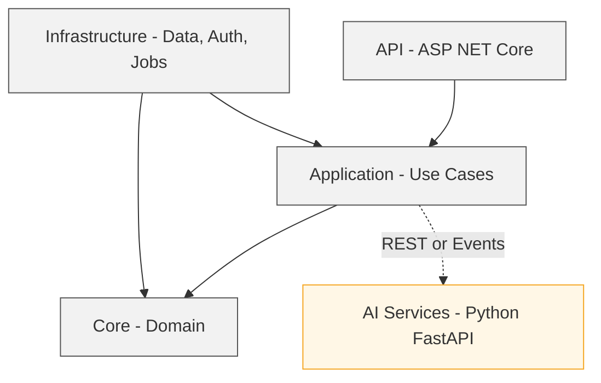

# FusionNet Clean Architecture — v2.0
**Version:** 2.0  
**Date:** 2025-10-19  

---

## 1. Purpose
#### 1.1 Define the FusionNet MVP layering model and allowed dependency rules.  
#### 1.2 Provide a stable reference for engineers, QA, and DevOps.  
#### 1.3 Exclude business workflows and personas which live in the *System Overview*.

---

## 2. Layered Architecture

### 2.1 Layers Used in FusionNet (Top to Bottom)
- **A. API (Presentation):** ASP.NET Core controllers and middleware. Exposes REST endpoints.  
- **B. Application:** Use cases and orchestration logic. No UI, no infrastructure.  
- **C. Core (Domain):** Entities, Value Objects, Aggregates, and Domain Exceptions. Contains pure business rules.  
- **D. Infrastructure:** External adapters for Data, Auth, Queues, and Observability. Implements interfaces from Application/Core.  
- **E. Dependency Rule:**  
  - API → Application  
  - Application → Core  
  - Infrastructure → Application/Core  
  - **No other dependency directions are allowed.**  
- **F. Cross-Cutting:** Validation, logging, telemetry, and configuration injected via interfaces.  
- **G. External AI:** Python FastAPI services external to the .NET process, accessed via REST and JSON contracts.  

---

## 3. Technology Mapping

| Layer | Technology | Purpose |
|-------|-------------|----------|
| **API** | ASP.NET Core (.NET 8) | Presentation and endpoint layer |
| **Application** | .NET 8 | Use cases, DTOs, services, and mappings |
| **Core (Domain)** | .NET Class Libraries | Domain logic, entities, aggregates |
| **Infrastructure** | PostgreSQL, Cosmos DB, Entra ID, Hangfire, MassTransit | Data access, auth, queues, jobs |
| **AI Integration** | Python FastAPI (OCR, Classification, Analysis) | External AI services |

---

## 4. Allowed Dependencies

- No module or layer may reach around the Application to call Infrastructure directly.  
- No project may reference another layer outward (Core never references Application or API).  
- Inter-module communication occurs only through REST or events — **no direct code references across modules**.  
- Each module maintains its own database schema or container. No shared tables or containers are allowed.

---

## 5. Data Persistence Strategy

- **PostgreSQL:** Stores structured workflow and project metadata, including checkpoints and reports.  
- **Cosmos DB:** Stores OCR results, extracted content, and AI artifacts.  
- Each module maintains **isolated schemas or containers** to ensure data segregation and traceability.

---

## 6. Non-Functional Requirements

- **Performance:** End-to-end ≤ 10 minutes (excluding human steps). Splitting baseline ≤ 2 minutes for 400 pages.  
- **Idempotency:** Section Splitter produces byte-identical outputs for identical inputs (**FR-303B**).  
- **Reliability:** Three retries with exponential backoff; all errors routed to the **Audit module**.  
- **Security:** Entra ID tokens required for every request; scoped by `organization_id` and `project_id`.

---

## 7. Reference Diagrams

*(Placeholder for Clean Architecture and Dependency Flow Diagrams)*

