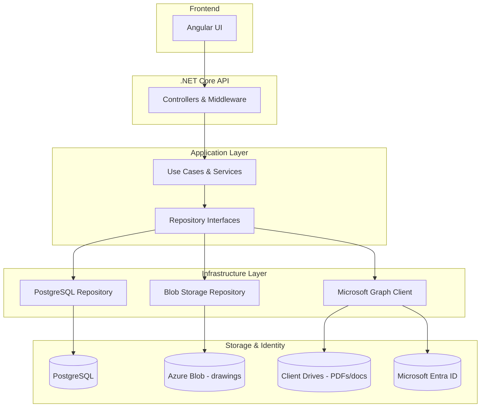
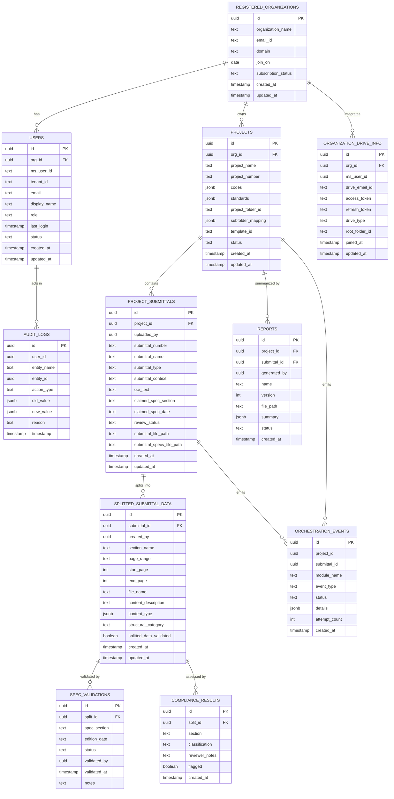
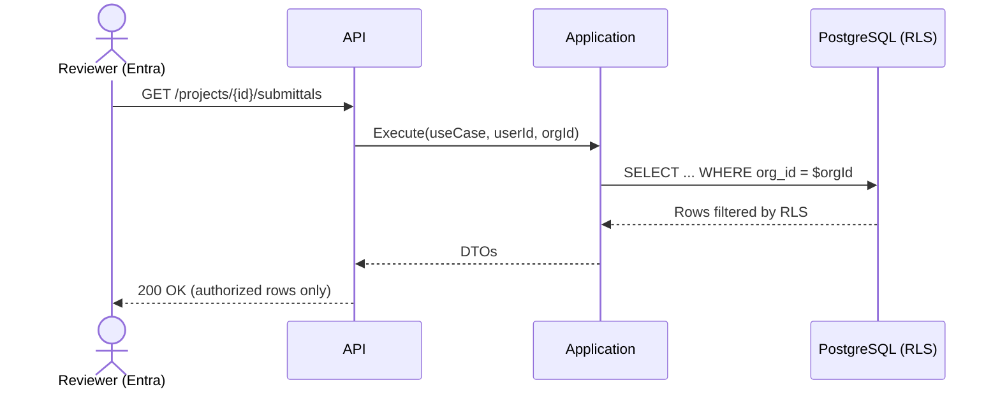

# Database Architecture Overview — v1.2
**Version:** 1.2  
**Date:** 2025-10-21

---

## 1. Executive Summary
The MVP database layer prioritizes reliability, tenant isolation, and simple operations. PostgreSQL is used for all structured and semi-structured MVP data (JSONB where needed), Azure Blob for drawings, and client drives (SharePoint/OneDrive) for original PDFs. Cosmos DB is deferred to Phase 2 after architecture review (§7.2).  

MVP scope covers Organization/Project management, Document ingestion, Submittal processing, Spec validation, Compliance tracking, Reporting, and comprehensive audit/lineage to meet BRD FR 301–FR 309.

---

## 2. Architecture Context

### 2.1 Problem
Manage transactional entities (projects, submittals), semi-structured review artifacts, and large files, with idempotent splitting and gated validation.  

### 2.2 Constraints
- Invite-only Entra SSO  
- Client data residency (files remain in client drives)  
- Idempotent Section Splitter (FR 303B)  
- E2E performance targets  

### 2.3 MVP Modularity
Clean/Onion monolith with strict module boundaries; no shared DB across modules (schema per module).  

### 2.4 High Level Data Flow

---

## 3. Core Principles
1. **PostgreSQL first (MVP)** – ACID, JSONB, GIN indexes; single operational store for MVP.  
2. **Schema per module** – Each module owns a DB schema; cross-module access via APIs/events.  
3. **Tenant isolation** – Rows scoped by `org_id`; RLS enforces per-org filtering.  
4. **Auditability** – Audit and orchestration tables record lineage, retries, HITL checkpoints.  
5. **Idempotency & gates** – Section Splitter deterministic (FR 303B); Spec Validator is hard gate (FR 305).

---

## 4. Technology Stack (MVP)
- **Primary DB:** PostgreSQL 15+ (structural + JSONB), B tree/GIN indexes; read replicas optional.  
- **Large files:** Azure Blob for drawings; client drives (SharePoint/OneDrive) for source PDFs and templates via Graph API references.  
- **Deferred:** Cosmos DB Phase 2, not in MVP runtime path.   
- **Repo enforcement:** Repositories in Infrastructure; Application never directly talks to DB; CI boundary checks in GitHub guide. 

---

## 5. Logical Data Architecture & Ownership

### 5.1 Domains & Primary Storage

| Domain                  | Tables                                         | Primary Storage                  |
|-------------------------|-----------------------------------------------|---------------------------------|
| Identity & Tenancy      | registered_organizations, users, organization_drive_info | PostgreSQL                      |
| Project Management      | projects                                      | PostgreSQL                      |
| Document Processing     | project_submittals, splitted_submittal_data  | PostgreSQL (+ file refs)        |
| Validation & Compliance | spec_validations, compliance_results         | PostgreSQL                      |
| Reporting               | reports                                       | PostgreSQL (+ file refs)        |
| System Tracking         | audit_logs, orchestration_events             | PostgreSQL                      |

### 5.3 Module Ownership Rules
- No shared database; schema per module  
- Contracts over references  
- Correlation IDs in inter-module calls

---

## 6. Schema Overview (MVP ERD)

**Note:** 
- MVP schema presently includes access_token/refresh_token in organization_drive_info
- secrets must be moved to Key Vault / Managed Identity and replaced with references per security posture.

---

## 7. Storage Strategy

### 7.1 PostgreSQL (MVP authoritative store)
- **Use cases:** Organizations, users, projects, submittals, splits, validations, compliance results, reports, audit, orchestration.  
- **Model:** 3NF with JSONB fields for evolving metadata.  
- **Indexes:** B tree for PK/FK; GIN on JSONB; composite indexes on hot paths.

### 7.2 Cosmos DB (Deferred Phase 2)
- **Decision:** Removed from MVP scope after review; PostgreSQL (with JSONB + audit tables) suffices initially.  
- **Implication:** Any references to Cosmos containers in other docs are Phase 2 placeholders and not deployed in MVP. 

### 7.3 Azure Blob
- **Use:** CAD/drawing artifacts with versioning and lifecycle policies; referenced from split metadata. 

### 7.4 Client Drives (SharePoint/OneDrive via Graph)
- **Use:** Source PDFs, templates, generated reports; file paths/IDs stored in DB, files remain in client tenant. 

---

## 8. Security & Compliance
- **Authentication/Authorization:** Microsoft Entra ID SSO; repository calls scoped by `org_id/project_id`.  
- **RLS (Row Level Security):** Enforce per org (and where applicable per project) filtering at DB level. Every query must pass tenant context.   
- **Auditability:** All CRUD/workflow actions captured in audit_logs and orchestration_events with retries and HITL checkpoints.  
- **Secrets:**: Managed Identity + Azure Key Vault; remove long lived tokens from DB tables (migrate organization_drive_info).   

### 8.5 RLS Enforcement (concept)

## 9. Decisions & Rationale (ADR Stubs)

- **ADR 001 — MVP Storage Scope:** Adopt PostgreSQL only for MVP; defer Cosmos DB to Phase 2 (simplifies ops; JSONB + audit suffice). Status: Accepted.  
- **ADR 002 — Module DB Isolation:** Enforce schema per module; cross module access only via APIs/events. Status: Accepted.  
- **ADR 003 — Secrets Handling:** Move OAuth tokens to Key Vault / Managed Identity; DB stores references only. Status: Accepted.  
- **ADR 004 — Audit & Lineage:** Use audit_logs + orchestration_events for end to end traceability & retries. Status: Accepted.  

---

## 10. Operational Posture

- **Performance targets:** Splitting ≤2 min for 400 pages; typical E2E ≤10 min (ex HITL). Track via module telemetry.  
-	**Indexing:** Ensure B tree for PK/FK and GIN for JSONB; review composite indexes per workload.  
-	**Backups & DR:** Daily full backups with PITR; encrypted at rest. (Baseline from storage strategy.)  
-	**CI/Quality Gates:** Boundary validator in CI; secrets managed via repo/env config.  

---

## 11. MVP Traceability to BRD

- **FR 301..304:** Ingestion, analyzer, OCR, idempotent splitting — persisted to project_submittals / splitted_submittal_data.  
- **FR 305..307:** Spec Validator gate + compliance routing — spec_validations, compliance_results.  
-	**FR 308:** Reports with versioning — reports + file refs.  
-	**FR 309:** HITL checkpoints + retries — audit_logs, orchestration_events. 
