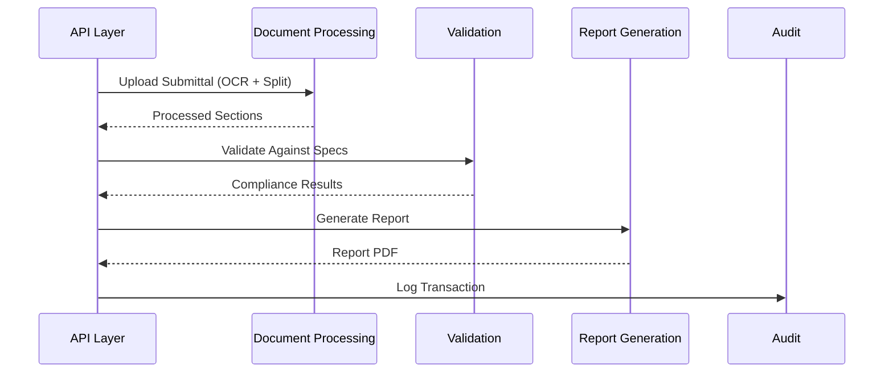

# Module Boundaries in FusionNet

Module boundaries are a **critical part of FusionNet’s architecture**.  
They ensure that each module is **independent, testable, and extractable** into its own microservice when the time comes.

---

## Why Module Boundaries?

- **Decoupling** → Modules can evolve independently.  
- **Testability** → Each module can be tested in isolation.  
- **Migration-readiness** → Easier extraction into microservices.  
- **Resilience** → Failures in one module do not cascade into others.  
- **Clarity** → Developers know where code should live.  

---

## 1. Current Modules (MVP)

The MVP modules align directly with the Business Requirements (FR-###) and repository structure:

1. **Review Orchestration**  
   - **Role:** Manages workflow and sequencing of modules.  
   - **Example:** Orchestrates “upload → split → validate → report”.  
   - **Repo:** `backend/src/FusionNet.Modules.ReviewOrchestration/`  
   - **Related FRs:** FR-302 (orchestration checkpoints)

2. **Document Processing**  
   - **Role:** OCR, classification, deterministic PDF splitting.  
   - **Repo:** `backend/src/FusionNet.Modules.DocumentProcessing/`  
   - **Related FRs:** FR-301 (uploads), FR-303 (analyzer), FR-303B (splitter), FR-304 (OCR)

3. **Validation**  
   - **Role:** Matches submittals against specifications; compliance checks.  
   - **Repo:** `backend/src/FusionNet.Modules.Validation/`  
   - **Related FRs:** FR-305 (spec validator), FR-306 (compliance classifier)

4. **Report Generation**  
   - **Role:** Produces standardized reports with version control.  
   - **Repo:** `backend/src/FusionNet.Modules.ReportGeneration/`  
   - **Related FRs:** FR-308 (report generator)

5. **Audit**  
   - **Role:** Logs every action for traceability.  
   - **Repo:** `backend/src/FusionNet.Modules.Audit/`  
   - **Related FRs:** FR-309 (HITL & checkpoints, audit logging)

---

## 2.Rules of Module Boundaries

- ❌ **No direct references** between modules.  
  Example: `Validation` cannot import code from `Document Processing`.  

- ✅ **Use Contracts and Events**  
  - Shared **DTOs** or **event contracts** in `Contracts/`.  
  - Communicate through **service bus events** or API calls.  

- ✅ **Independent Configuration**  
  - Each module has its own section in `appsettings.json`.  

- ✅ **Dedicated Database Schema**  
  - No shared schema/container between modules.  

- ✅ **Custom Exceptions per Module**  
  - Example: `ValidationException` belongs only to Validation.  

---

## 3. Enforcement

FusionNet enforces boundaries using:
1. **Tools**  
   - `tools/ModuleBoundaryValidator/` → checks illegal references.  

2. **Scripts**  
   - `scripts/module-boundary-check.ps1` → runs locally.  

3. **CI/CD**  
   - GitHub Action runs boundary validation on each PR.  
   - PRs that break boundaries cannot be merged.  

---

## 4. GitHub Labels for Boundary Tracking

Labels help track module readiness for microservice extraction:

| Label                    | Purpose |
|---------------------------|---------|
| `module:review-orchestration` | Tracks orchestration module |
| `module:document-processing`  | Tracks OCR/splitting |
| `module:validation`           | Tracks spec matching & compliance |
| `module:report-generation`    | Tracks reporting |
| `module:audit`                | Tracks auditing |
| `extraction-ready`            | Module is microservice-ready |
| `needs-refactor`              | Cleanup required before extraction |
| `has-shared-db`               | DB schema shared (technical debt) |
| `performance-impact`          | SLA/performance risk |
| `idempotency-required`        | Must guarantee deterministic outputs |
| `hitl-checkpoint`             | Human review point required |

---

## 5. Pre-Extraction Checklist

Before extracting any module into a microservice:

### Code Preparation
- [ ] No direct cross-module references.  
- [ ] Interfaces/contracts live in `Contracts/`.  
- [ ] Test coverage > 80%.  
- [ ] Module-specific exceptions exist.  
- [ ] Logging categories are module-specific.  

### Infrastructure
- [ ] Dedicated DB schema/container.  
- [ ] Health check endpoint (`/health`).  
- [ ] Metrics/telemetry configured.  
- [ ] Retry + circuit breaker policies in place.  

### CI/CD
- [ ] Independent build pipeline.  
- [ ] Separate deployment configuration.  
- [ ] Secrets stored in Key Vault.  
- [ ] Rollback procedures documented.  

### Documentation
- [ ] API docs complete.  
- [ ] Runbooks updated.  
- [ ] ADRs (Architecture Decision Records) documented.  
- [ ] Disaster recovery plan exists.  

---

## 6. Developer Guidelines

- ✅ Define interfaces/contracts in `Application` or `Contracts`, implement in `Infrastructure`.  
- ✅ Keep modules **autonomous** — no shared state.  
- ✅ Add tests for module-specific functionality.  
- ✅ Use **labels** when creating PRs/issues to track maturity.  

- ❌ Do not share repositories/static classes across modules.  
- ❌ Do not bypass contracts for quick fixes.  
- ❌ Do not hardcode connections/configs inside a module.  

---

## 7. Example Workflow Across Modules

---

###  Summary
- FusionNet modules are strictly separated with enforced boundaries.
- Each module must be independent in code, DB, and config.
- Validators + CI/CD checks guarantee enforcement.
- GitHub labels + checklists track extraction readiness.
- Following these rules ensures FusionNet evolves smoothly from monolith → microservices.
