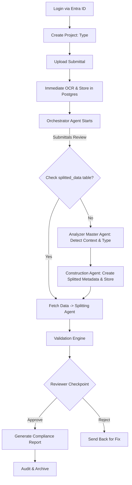

# FusionNet Architecture Overview

This document provides a **comprehensive overview** of the FusionNet MVP architecture.  
It is designed as the first stop for new developers joining the project, giving them the **context, structure, workflows, and best practices** needed to contribute effectively.

---

## 🎯 Purpose of FusionNet

FusionNet is a **submittal review and compliance automation platform**.
It ingests technical documents (PDFs, drawings, product data), extracts and validates their contents, and generates compliance reports.  

Key objectives:
- Automate repetitive **document checks** (OCR, metadata extraction, spec validation).
- Support **human-in-the-loop (HITL)** reviews where manual intervention is needed.
- Provide **end-to-end traceability** through audit logs and reports.
- Meet **performance SLAs**:  
  - 10 minutes maximum for full workflow.  
  - 2-3 minutes for splitting/processing 900-page PDFs.

---

##  Why Monolith First?

FusionNet follows a **monolith-first strategy** for the MVP phase.

- **Timeline** → The MVP must be delivered in **10 weeks**. A single repository allows rapid iteration.  
- **Consistency** → All components (frontend, backend, AI services) live together for simpler coordination.  
- **Future-proofing** → We design using **clean architecture + module boundaries**, so the system can be extracted into **microservices** later without major rework.  

**Planned Evolution**:  
- **Phase 1 (Now)** → Monolith MVP.  
- **Phase 2 (Month 4)** → Prepare modules for extraction using labels & checklists.  
- **Phase 3 (Month 6)** → Begin extraction into separate repositories (`fusionnet-document-processing`, `fusionnet-validation`, etc.).  

---

## 🏗️ Repository Structure
```
fusionnet-submittal-mvp/
├── frontend/           # Angular application
├── backend/            # .NET Core (Domain, Application, Infrastructure, API)
├── ai-services/        # Python services (OCR, ML models, FastAPI APIs)
├── claude-code/        # Prompt templates & validation logic
├── tests/              # Unit, integration, performance, prompt tests
├── docs/               # Documentation (this folder)
├── scripts/            # Setup, validation, migration helpers
├── tools/              # Validators for module boundaries & prompts
└── .github/            # CI/CD workflows (build, deploy, security scanning)
```
---

## Key Architectural Concepts

### Layers (Clean Architecture)
1. **Core (Domain)**  
   - Entities, Value Objects, Aggregates, Domain Exceptions.
   - Pure business rules, no dependencies.
   - Example: Submittal, Reviewer, DocumentSection.

2. **Application**  
   - UseCases, DTOs, Services, Mappings.
   - Orchestration of business workflows.
   - Example: ValidateSubmittalUseCase, SplitPdfUseCase.

3. **Infrastructure**  
   - External adapters:
      - **Persistence:** CosmosDB, PostgreSQL.
      - **Auth:** Microsoft Entra ID.
      - **Workflow:** Hangfire background jobs.
   - Implements interfaces defined in Core & Application.

4. **API (Presentation)**  
   - ASP.NET Core controllers, middleware, filters.
   - Exposes REST endpoints to frontend & integrations.
   - Example: /api/auth/login, /api/auth/logout, /api/projects/createproject.

---

## 🔑 Guiding Principles
- **Module boundaries enforced** by `ModuleBoundaryValidator` and CI checks.
- **No shared database** → each module has its own schema/container.
- **Contracts not references** → inter-module communication through APIs/events.
- **Performance SLA**:
  - 10 min end-to-end
  - 2-3 min for splitting 900-page PDFs
- **Human-in-the-loop checkpoints** for compliance & validation.

---

## System Components
### Frontend (Angular)
- Provides UI for project creation, submittal uploads, reviewer workspace.
- Calls backend APIs via REST.
- Roles enforced via JWT tokens from Entra ID.

### Backend (.NET Core)
- Implements Clean Architecture.

#### Responsible for:
- Authentication & authorization.
- Orchestrating workflows.
- Validating module boundaries.
- Exposing API endpoints.
- AI Services (Python)
- Independent ML modules (FastAPI).

#### Functions:
- OCR: Google Vision, Azure Document Intelligence.
- Splitting: Deterministic PDF splitter.
- Classification: Cover-page identification, document type classification.
- Analysis: Claude AI integration for advanced checks.

#### Claude-Code
- Prompt engineering workspace.
- Stores prompt templates, validation tests, examples, and deterministic output validators.
- Supports AI-driven compliance checks.

---

#### Tests
**Organized by module:**
- FusionNet.Core.Tests → Domain logic.
- FusionNet.Application.Tests → Use cases.
- FusionNet.Integration.Tests → API + database.
- FusionNet.Performance.Tests → Load & benchmark tests.
- FusionNet.PromptTests → AI prompt validation.

---

### Typical Workflow

**1. Authentication →** User logs in with Microsoft Entra ID.

**2. Project Creation →**
- Organization admin creates a project.
- Project includes a type field (e.g., Submittals Review, RFP, etc.).

**3. Upload Submittal →** User uploads PDF/document.

**4. Immediate OCR Processing →**
- OCR runs right after upload.
- Extracted data stored in Postgres with references to user, project, and file name.

**5. Orchestrator Agent Starts →**
- Reads project type and triggers different flows.
- Example: Submittals Review flow.

**6. Submittals Review Flow →**
- Check if data exists in splitted_data table.
- If present → Fetch and pass directly to Splitting Agent.
- If not present :
   - **Analyzer Master Agent runs:**
      - Identifies document context and document type from OCR results.
   - **Construction Agent:**
      - Generates splitted metadata for the next module.
      - Saves metadata into database.

**7. Splitting & Validation →** Continue workflow with splitting, compliance validation, HITL review.

**8. Report Generation →** Compliance report produced.

**9. Audit Logging →** All actions stored for traceability.

---

### flowchart TD


---

### Tech Stack

- **Frontend:** Angular 16, TypeScript.
- **Backend:** .NET 8 (C#), ASP.NET Core Web API.
- **Databases:** PostgreSQL, Azure CosmosDB.
- **AI Services:** Python (FastAPI, PyTorch, OpenAI/Claude APIs).
- **Authentication:** Microsoft Entra ID (OIDC).
- **CI/CD:** GitHub Actions, Docker, Azure App Service.
- **Security:** Snyk, TruffleHog, Dependabot, SonarQube.
- **Monitoring:** Azure Application Insights, Teams Alerts.

---

### Developer Practices

- **Branching Strategy:** main (stable), develop (active dev).
- **Commit Messages:** Conventional commits (feat(module): description).
- **Code Reviews:** Enforced via CODEOWNERS + PR approvals.
- **Testing:** >80% coverage required for core modules.
- **Documentation:** Every feature/update must include docs & ADRs.
- **Secrets:** Never in code → always in GitHub Secrets / Key Vault.
