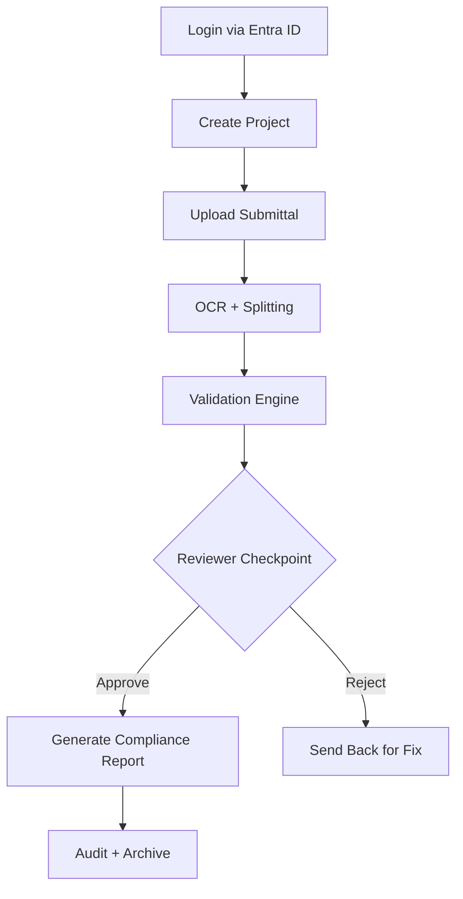

# FusionNet Submittal API

This document provides a comprehensive overview of the FusionNet Submittal API, outlining its purpose, structure, core modules, and end-to-end workflow. It serves as a reference for understanding how the API enables project creation, submittal processing, validation, and report generation within the FusionNet platform.

---

## Table of Contents
1. [Project Overview](#project-overview)  
2. [Folder Structure](#folder-structure)  
3. [Authentication & Authorization](#authentication--authorization)  
4. [Key Modules](#key-modules)  
5. [API Endpoints](#api-endpoints-examples)  
6. [Workflow](#workflow)  
7. [Development Tips](#development-tips)  

---

## Project Overview

FusionNet Submittal API is responsible for:

- Handling project creation and submittal uploads  
- Performing OCR and document splitting  
- Running validation engines  
- Generating compliance reports  
- Managing reviewer checkpoints  
- Auditing and archiving  

The backend is built using **.NET** and communicates with the Angular frontend, AI services, and other internal modules.

---
## Folder Structure

```
fusionnet-submittal-mvp/
├── backend/ # .NET backend API
│ ├── src/
│ │ ├── FusionNet.API/ # Main API project
│ │ ├── FusionNet.Infrastructure/ # DB, ORM, and infrastructure
│ │ ├── FusionNet.Application/ # Business logic
│ │ └── FusionNet.Domain/ # Core domain models
├── frontend/ # Angular frontend
│ ├── src/
│ │ ├── app/
│ │ │ ├── core/ # Core services, guards, interceptors
│ │ │ └── modules/ # Feature modules
├── ai-services/ # Python AI/ML services
│ ├── src/
│ │ ├── document_processing/
│ │ │ ├── ocr/
│ │ │ └── splitter/
│ │ └── agents/
└── scripts/ # Helper scripts for dev & CI
├── install-hooks.sh
├── validate-determinism.sh
├── validate-json-in-markdown.py
├── module-boundary-check.ps1
├── setup-local-env.sh
└── generate-migration.sh
```


---

## Authentication & Authorization

- **Login:** Handled via Entra ID (Azure AD) in the backend. Frontend only consumes the authentication token.  
- **Logout:** Backend invalidates the session and clears cookies.  

**Pros of backend-only auth:**

- Centralized security control  
- Reduced frontend complexity  

**Cons:**

- API becomes the single point of failure  
- Token management must be carefully handled  

---

## Key Modules

| Module                       | Responsibility                                           |
|-------------------------------|---------------------------------------------------------|
| Project Management            | Create, read, update, delete projects                  |
| Submittal Management          | Upload submittals                                      |
| OCR Engine                    | Process documents using Google Vision or Azure Doc Intelligence |
| Document Splitter             | Split large PDFs into smaller components               |
| Validation Engine             | Business rule validation on uploaded submittals        |
| Reviewer Checkpoint           | Review, approve, or reject submittals                  |
| Compliance Report Generator   | Generate and store compliance reports                  |
| Audit & Archive               | Maintain history and archival of submittals            |

---

## API Endpoints (Examples)

### Project

| Endpoint                          | Method | Description          |
|----------------------------------|--------|--------------------|
| /api/projects/createproject       | POST   | Create a new project|
| /api/projects/projectdetails/{id} | GET    | Get project details |
| /api/projects/updateproject/{id} | PUT    | Update project      |
| /api/projects/deleteproject/{id} | DELETE | Delete project      |

### Submittal

| Endpoint                             | Method | Description                  |
|-------------------------------------|--------|------------------------------|
| /api/submittals/uploadsubmittal      | POST   | Upload submittal             |
| /api/submittals/getsubmittal/{id}    | GET    | Retrieve submittal           |
| /api/submittals/{id}/ocr             | POST   | Trigger OCR processing       |
| /api/submittals/{id}/validate        | POST   | Run validation engine        |
| /api/submittals/{id}/review          | POST   | Reviewer approve/reject      |

---

## Workflow


1. Users log in via Entra ID if they belong to a registered organization.
2. Organization can create a project and upload submittals.
3. Clicking "Ready to Review" triggers OCR engine and document splitter for respective submittals.
4. Validation engine ensures compliance.
5. Reviewer approves/rejects submittals.
6. Compliance report is generated, and records are archived.

## Development Tips

- Always use Infrastructure → Application → API flow for logic separation.
- Run scripts/validate-determinism.sh before committing.
- Use module-boundary-check.ps1 to ensure decoupled modules.
- AI services are isolated in ai-services/src and should not affect API runtime.
- Follow naming conventions in backend and frontend for consistency.


